# Lipid Droplets Characterization

An ImageJ/Fiji plugin for the morphological and photometric characterization of spherical microparticles from optical or confocal microscopy images. This plugin offers a graphical interface that allows users to apply a complete image processing pipeline.  

A [parameters description](Parameters.md) is available.

## Credits

**Abdullah AL MAMUN** \
**Yahya MUDALLAL** \
**David VADIMON**
 
## License

This project is licensed under the GPL-3.0 license.

## Download and Installation

You can download the latest version of the plugin's `.jar` file from the [releases page](https://github.com/FattaccioliLab/lipid-droplets-characterization/releases).

To install it, simply place the `.jar` file into the **plugins** folder of your Fiji directory. If installed correctly, you will be able to find **Lipid Droplets Characterization** at the bottom of the Plugins menu in Fiji.

## Contributing

If you want to contribute to the project, please consider reading the [developer README](README_DEV.md).

## 🎬 Demonstration

## Explanation of the plugin's usage

The following section explains how to use the plugin and describes its features.
This is how the overall UI presents itself.

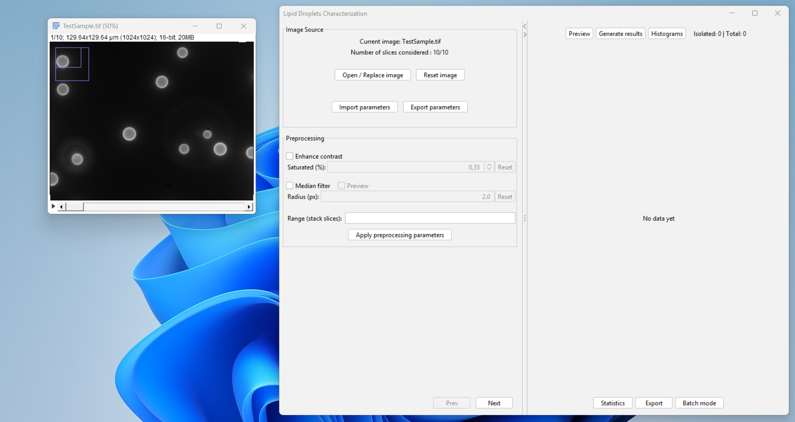

### Preprocessing

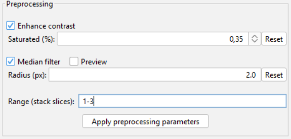

The preprocessing section of the pipeline allows you to apply preliminary treatments to the images. The available preprocessing steps are the following:  
- **Enhance contrast**: This is just a visual tool; it does not affect pixel values.  
- **Median filter**: Applies a median filter to the image with the specified radius. The possibility to preview the filter's effect is offered by checking the Preview checkbox.  
- **Consider a sub-stack**: From that step, you can decide to continue with a specific range of slices from the original image stack, by defining this range in a format similar to printing pages `i.e. 1-3,7,12-15`.  

When changing an input value for the contrast or the median filter, it takes effect either by pressing ENTER while having the input focus, or just automatically by loosing the input focus.

### Thresholding

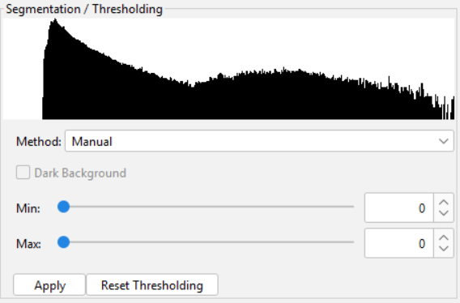

In the thresholding section, you must create a binary mask of the image by applying a threshold.  
The threshold can either be set manually or determined automatically using one of the following methods:  
- **Otsu**  
- **Moments**  
- **Triangle**  
- **Yen**  
- **Li**

If you choose an automatic method, make sure to check the **Dark Background** option if the background of your image is dark.  
Note that the histogramm currently showed remains the one from the original stack, but the methods are effectively applied on the sub-stack pixel range, if a sub-stack has been previously chosen.  

From here, it is required to **keep the generated mask opened** until particle analysis results for ensuring a correct plugin behavior.  

### Operations on the binary mask

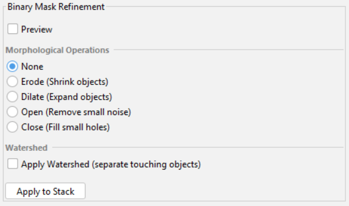

After generating the binary mask, you can refine it by applying some modifications. You can choose **exactly one** morphological operation among the following:
- **Erosion**: Shrinks the objects.
- **Dilation**: Expands the objects.
- **Opening**: Removes small noise/objects.
- **Closing**: Fills small holes.

You can also apply the **Watershed** algorithm, which separates touching objects. If a binary operation has been previosly selected, the watershed will be applied after doing the previous operation.   
These modifications can be previewed before being definitively applied by checking the Preview checkbox.  

### Particle analysis

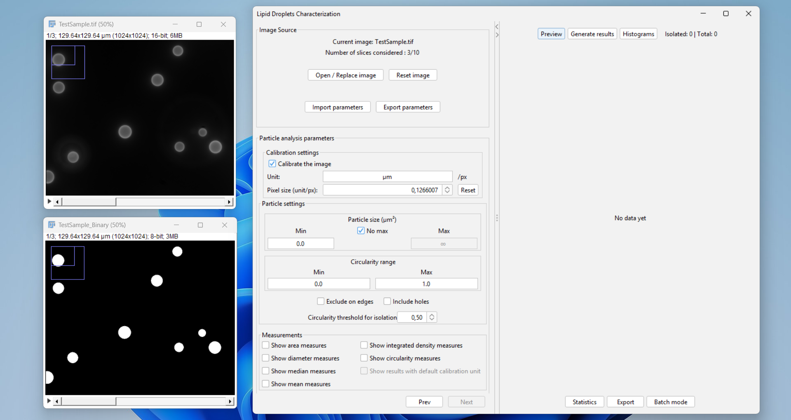

This section allows the user to configure the parameters for the particle analysis. The parameters to configure are the following:

**Calibration settings**

In this section, you can calibrate the image by defining the unit and the ratio (unit/px) of the calibration. By default, this is set to the calibration found in the image's metadata, if available.

**Particle settings**

In this section, you can define a minimum and maximum **Size** and **Circularity** for the particles you want to keep in the final results.
You can also choose whether to **exclude particles on the edges** of the image or to **include holes**.  
Previous options are used to filter particles to consider for the analysis. Additionally, you can set the **circularity threshold** to determine if a particle is isolated: if a particle **does not touch the edges** and has a **circularity above the threshold**, it will be considered **isolated**.  

Particles size and circularity inputs are taken into account on the next result generation. Invalid inputs are only switched to safe values before the generation.

**Measurements**

Here, you can check the box for each property you want to measure from the particles in the final results. The available measurements are:
- **Area**: The area of the particles in px² or unit², depending on whether the image is calibrated.
- **Diameter**: The diameter of the particles in px or unit, depending on whether the image is calibrated.
- **Median**: The median intensity of the particles.
- **Mean**: The mean intensity of the particles.
- **Integrated density**: The integrated density of the particles.
- **Circularity**: The circularity of the particles.

The **Show results with default calibration unit** checkbox can only be selected when **Calibrate the image** is unchecked. If selected, the results will be displayed using the original calibration from the image's metadata, if available.

### Generating results

After completing the processing pipeline, you can proceed to the particle analysis to generate your data using the tools available on the right panel of the UI.

**Preview** 

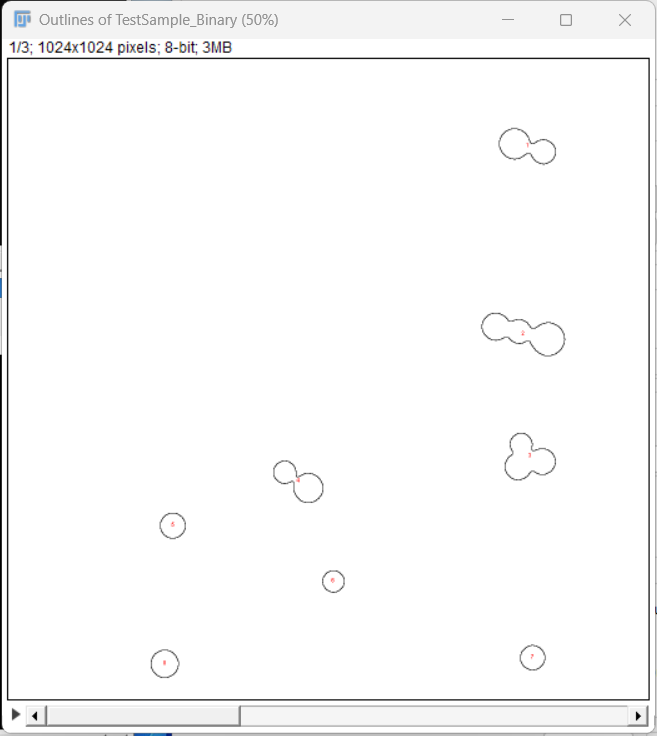

The **Preview** button opens a new window showing the outlines of the particles detected based on your current analysis parameters.

**Generate results**

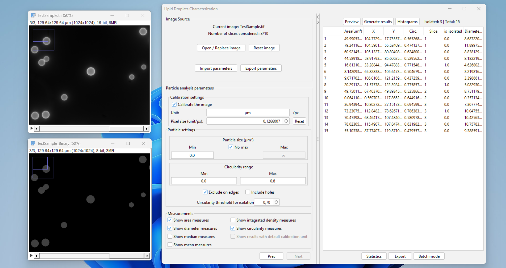

This button runs the full analysis and displays the raw data for each analyzed particle. In this results table, each row represents a single particle. It includes its specific properties such as X and Y coordinates, the slice number it belongs to, and the **is_isolated** indicator (which equals `1.0` if the particle is isolated and `0.0` otherwise), alongside all the measurements selected in the parameters section.

**Histograms**

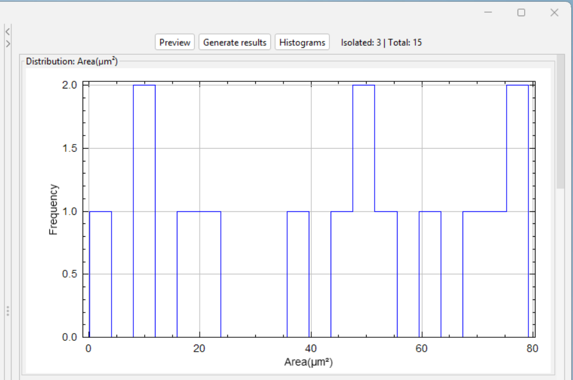

After generating the results, you can display frequency distributions for your measured properties by clicking the **Histograms** button. You can double-click on any histogram to open it in a separate window and save it using the standard Fiji menu.

**Statistics**

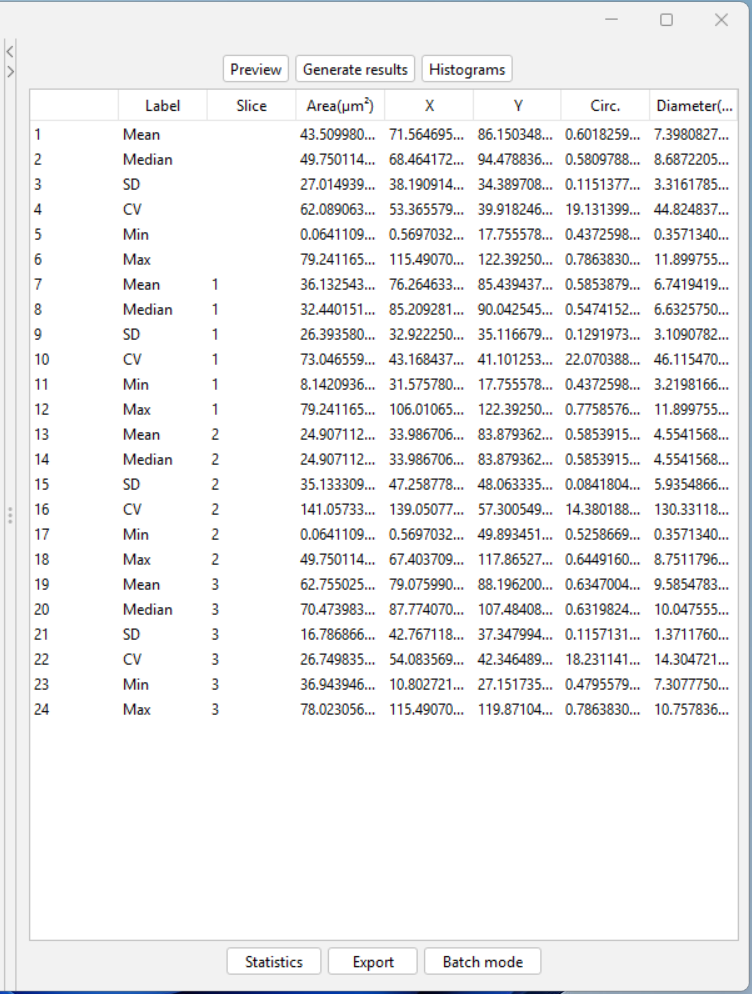

Clicking the **Statistics** button computes the overall statistical metrics for your data. For each property, it generates the Mean, Median, Standard Deviation (SD), Coefficient of Variation (CV), Minimum, and Maximum values. The table displays these metrics globally for all slices combined, followed by a detailed breakdown for each individual slice.

**Export**

The **Export** button allows you to save the currently displayed table (either the raw results or the statistics) as a CSV file, maintaining the exact format shown in the UI. Therefore, if you want to export the raw particle data, ensure the results table is active by clicking **Generate results** beforehand; likewise, click **Statistics** before exporting if you wish to save the statistical summary.

**Batch mode**

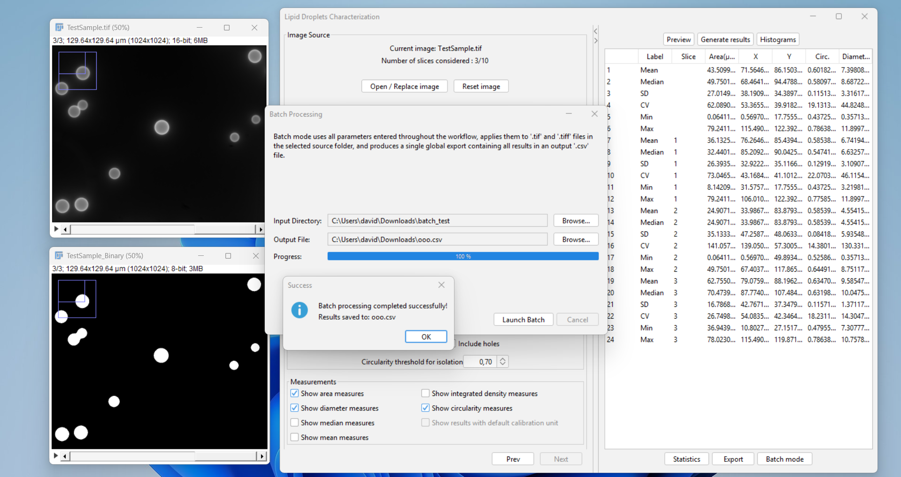

By clicking the **Batch mode** button, you can process multiple image files simultaneously. A dialog will prompt you to select an input directory containing your images and an output destination for the final global CSV file.

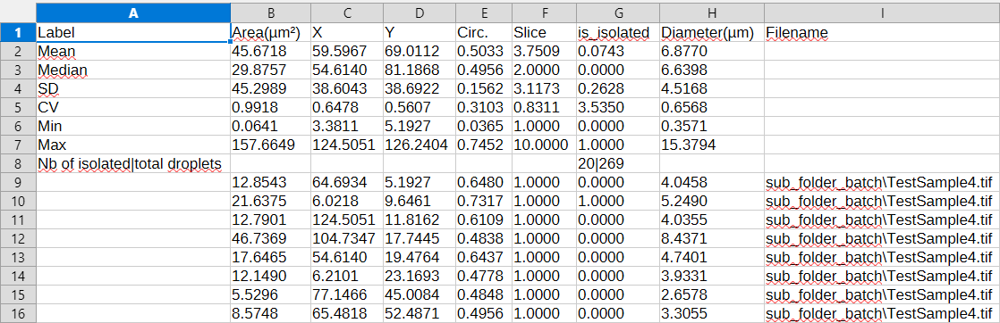

The output CSV file from the batch mode combines global and individual data. The top rows present the aggregated statistics across all processed images, while the subsequent rows list every single detected particle with its metrics and the filename of the image it was extracted from.

### Parameter Export/Import

The **Image Source** section at the top of the interface provides option buttons to import or export your pipeline configurations.

- **Export parameters**: Saves your current configuration into a JSON file. If you haven't completed the entire pipeline, default values will automatically be assigned to the unconfigured steps.
- **Import parameters**: Loads an existing JSON parameters file. Upon importing, a dialog will ask you to select a specific target step in the workflow up to which the parameters should be automatically applied. If the particle analysis step is selected, you must still manually generate the results once the navigation has been done.  

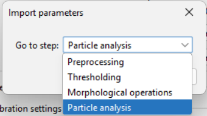